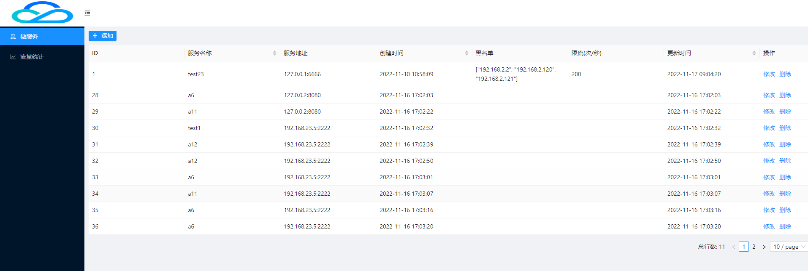

# Python微服务网关

## Introduction - 介绍
网关服务是单一访问点，并充当多项服务的代理。服务网关启用了跨所有服务的变换、路由和公共处理。
### Summary - 概要
动态路由：动态将请求路由到不同后端服务

黑名单:限制某些IP的访问

频次限制:限制每个微服务的访问频次

流量统计:正在开发

统一认证:待开发

权限管理:待开发

### Features - 特性
1.可视化的界面配置

## Configuration - 配置（配置信息。）

python:3.6及以上
react:18.2.0及以上
mysql:5.7.8及以上(支持存储json数据)

## Installation - 安装
git clone下载

## Usage - 用法
1.进入到"backend"目录,执行`pip install -r ./requirements.txt`

2.进入到"fronted"目录,执行`npm install`

3.进入mysql,执行
`
CREATE TABLE IF NOT EXISTS `gateway_mapping`(
   `id` INT UNSIGNED AUTO_INCREMENT,
   `service_name` VARCHAR(20) NOT NULL unique,
   `host` VARCHAR(20) NOT NULL,
   `is_alive` INT(1)  NULL,
   `black_list` json,
   `number` int,
   `delete_time` timestamp NULL,
   `create_time` timestamp NULL default CURRENT_TIMESTAMP,
   `update_time` timestamp NULL default CURRENT_TIMESTAMP ON UPDATE CURRENT_TIMESTAMP,
   PRIMARY KEY ( `id` )
)ENGINE=InnoDB DEFAULT CHARSET=utf8;
`

4.分别在"backend"目录及"fronted"目录,执行`python main.py`,`npm start`

## Development - 开发（关于怎样开发的文档信息。（API 等。））
生产环境请配合nginx进行反向代理

## FAQ - 常见问题（常见问题。）
暂无

## License - 版权信息（版权和许可信息（或阅读许可证）、法律声明。）